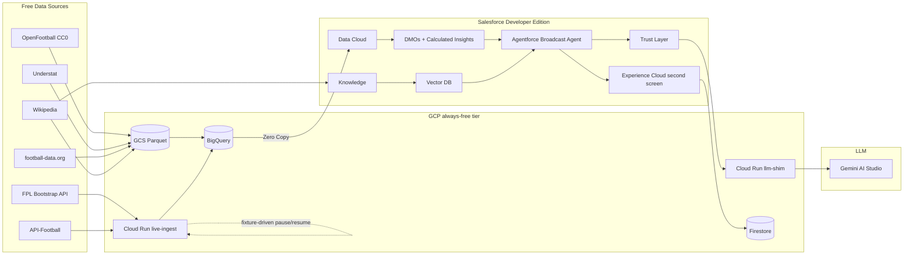

# Fan360 - Second-Screen EPL Broadcast Agent

> A free-tier, end-to-end Salesforce + GCP build of an Agentforce-powered second-screen experience for English Premier League broadcasts. Built as a portfolio piece for a Salesforce Forward Deployed Engineer / Customer Success Architect / Agentforce Solution Engineer track.

## What it does

A fan watching an EPL match opens a companion web page. They ask in natural language - "Has anyone scored more goals against Chelsea than Salah?", "Why did Arsenal switch to a back five against Liverpool in 2024?", "Who has the highest xG in the current match?" - and the page answers in seconds with citations drawn from structured match data (OpenFootball EPL results from 2010/11 onward) plus unstructured tactical narratives.

The reasoning runs inside Salesforce Agentforce. The data lives in Salesforce Data Cloud (federated from BigQuery via Zero Copy) and Salesforce Knowledge (plus a vector index). The LLM is Gemini, called via a Cloud Run shim that makes the free Gemini AI Studio API look like a Vertex AI endpoint to Salesforce's BYO LLM Model Builder.

Total ongoing cost: **$0** (BigQuery Sandbox through Phase 1; defer GCP billing until Phase 2 Cloud Run; see phase runbooks).

## Architecture

## Repository layout

| Path                     | Contents                                                                                                                  |
| ------------------------ | ------------------------------------------------------------------------------------------------------------------------- |
| `etl/`                   | Python ETL package: source loaders, normalization, BigQuery load, embedding pipeline                                      |
| `cloud-run/llm-shim/`    | FastAPI service that translates Vertex API shape to Gemini AI Studio (Phase 6)                                            |
| `cloud-run/live-ingest/` | FastAPI service handling live webhooks (Phase 2)                                                                          |
| `force-app/`             | Salesforce DX source tree: Apex, LWC, Agent Script, prompt templates, flows, metadata                                     |
| `sql/`                   | BigQuery DDL: datasets, external tables, materialized views (`marts/`)                                                    |
| `notebooks/`             | Jupyter notebooks for validation and ad-hoc exploration                                                                   |
| `docs/`                  | Runbooks, OpenAPI specs, team mapping CSV                                                                                 |
| `docs/runbooks/`         | Click-by-click guides for the parts an automated agent cannot perform (account signup, OIDC handshakes, UI configuration) |
| `scripts/`               | Bootstrap and helper scripts (PowerShell + bash)                                                                          |
| `.secrets/`              | Local-only secrets folder (git-ignored except for `.gitkeep`)                                                             |

## Quick start

Full step-by-step provisioning lives in [docs/runbooks/phase0-provisioning.md](docs/runbooks/phase0-provisioning.md). The condensed version:

1. **Salesforce Developer Edition with Agentforce + Data Cloud.** Sign up at [developer.salesforce.com](https://developer.salesforce.com/form/developer-signup/?d=pb&bc=HA), authorize with
  sf org login web -a football_agent`.
2. **GCP project.** Create project ID `sf-fan360` (see [phase 0 runbook](docs/runbooks/phase0-provisioning.md)). Use a fresh Google account or harden a personal one; defer billing until Phase 2.
3. **Local toolchain.** Python 3.11+, Node 22+, Salesforce CLI, gcloud CLI.
4. **Configure environment.** `cp .env.example .env`, fill in API keys.
5. **Install Python ETL.** `pip install -e ".[dev]"` (or `uv pip install -e ".[dev]"`).

## Build status by phase

- Phase 0 - Provisioning + toolchain
- Phase 1 - Historical data ETL to BigQuery
- Phase 2 - Live event feed (Cloud Run)
- Phase 3 - Data Cloud Zero Copy + Ingestion API
- Phase 4 - Knowledge + Vector RAG
- Phase 5 - Agentforce agent (topics, actions, ADLC loops)
- Phase 6 - BYO LLM via Cloud Run shim
- Phase 7 - Second-screen Experience Cloud site
- Phase 8 - Portfolio packaging (Loom, LinkedIn posts, CFP)

## Attribution

All data sources are credited in [ATTRIBUTIONS.md](ATTRIBUTIONS.md). This is a non-commercial portfolio project; no source data is republished outside the  
private GCP project that hosts the build.

## License

Code in this repository is MIT-licensed. Data attributions, where required by the source, are documented in `ATTRIBUTIONS.md`. The Premier League name and all club marks are trademarks of their respective holders; this project is unaffiliated.