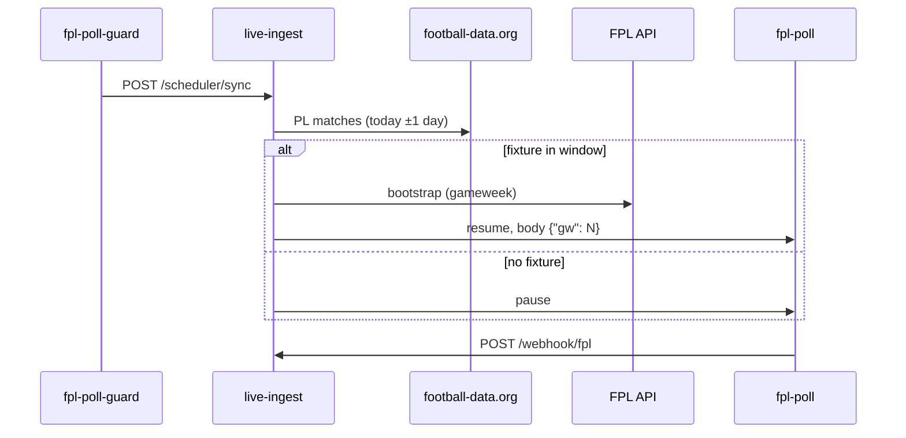

# Phase 2 — Live event feed

**Goal.** Deploy Cloud Run service `live-ingest` and wire Cloud Scheduler so FPL live points stream into BigQuery only during real EPL match windows.

**Time budget.** ~2 hours.

**Prerequisites.**

- [phase1-historical-etl.md](phase1-historical-etl.md) exit gate holds.
- Repo root, `.venv` activated, `gcloud` aimed at project `sf-fan360`.
- `.env` contains `FOOTBALL_DATA_API_KEY`, `API_FOOTBALL_KEY`, and (from this phase) `ETL_LOCAL_ONLY=0`.
- Billing will be enabled in Step 1 (required for Cloud Run, GCS, Scheduler).

---

## Overview


| Job              | Schedule                   | Target                 | Role                                                                        |
| ---------------- | -------------------------- | ---------------------- | --------------------------------------------------------------------------- |
| `fpl-poll-guard` | Every 5 min                | `POST /scheduler/sync` | Reads football-data.org calendar; pauses or resumes `fpl-poll`; sets `{gw}` |
| `fpl-poll`       | Every 1 min (when enabled) | `POST /webhook/fpl`    | Polls FPL `/event/{gw}/live/`; writes diffs to BigQuery                     |


`fpl-poll` is created **paused**. The guard keeps it off between matches (~288 guard calls/day; poll runs only in-window).

**API usage.** The guard calls **football-data.org** (~12 times/hour). `fpl-poll` calls **FPL only** (no football-data quota when polling every minute).




**Poll window (UTC).** Start = kickoff − 10 min. Default end = kickoff + 105 min + 15 min. While status is `IN_PLAY` / `LIVE` / `PAUSED`, end extends to `now + 15 min`.

---

## Step 1. Enable billing and budget kill-switch

1. GCP Console → **Billing** → link a billing account (90-day / $300 trial applies automatically).
2. Apply your local budget kill-switch checklist: budget **$10/month**, Pub/Sub function to disable billing at 100%, send a test message, confirm billing disables, then **turn billing back on** for the rest of this phase.
3. Verify:

```powershell
gcloud beta billing projects describe sf-fan360
# billingEnabled: true
```

---

## Step 2. APIs, service accounts, GCS ETL

### 2a. Enable billing APIs and service accounts

```powershell
.\scripts\gcp-setup.ps1 -ProjectId sf-fan360 -EnableBilling
```

This enables Cloud Run, Cloud Scheduler, Pub/Sub, Firestore, Vertex AI, and creates `etl-service`, `llm-shim`, `live-ingest` with project roles including `roles/cloudscheduler.admin` on `live-ingest@sf-fan360.iam.gserviceaccount.com`.

### 2b. Point ETL at GCS and load data

Set in `.env` (or the session):

```
ETL_LOCAL_ONLY=0
```

```powershell
gcloud storage buckets create gs://sf-fan360-raw `
    --location=EU --uniform-bucket-level-access

python -m etl.run_full
```

Log line must include `run_full: mode=gcs`.

```powershell
gcloud storage ls -r gs://sf-fan360-raw/openfootball/matches/** | Select-Object -First 5
```

BigQuery external tables and marts are refreshed by the same orchestrator as Phase 1.

---

## Step 3. Deploy `live-ingest`

All commands from **repo root** unless noted.

### 3a. Artifact Registry

```powershell
gcloud artifacts repositories create live-ingest `
    --repository-format=docker `
    --location=europe-central2 `
    --description="sf-fan360 live-ingest images"
```

### 3b. Secret Manager

Load `.env` into the session when variables are missing:

```powershell
if (Test-Path .env) {
    Get-Content .env | ForEach-Object {
        if ($_ -match '^\s*([A-Za-z_][A-Za-z0-9_]*)=(.*)$') {
            $key = $Matches[1]
            if ([string]::IsNullOrEmpty([Environment]::GetEnvironmentVariable($key))) {
                $val = $Matches[2].Trim().Trim('"').Trim("'")
                Set-Item -Path "env:$key" -Value $val
            }
        }
    }
}

function Add-GcpSecretVersion {
    param([string] $SecretId, [string] $Plaintext)
    if ([string]::IsNullOrWhiteSpace($Plaintext)) {
        throw "Empty value for secret $SecretId"
    }
    gcloud secrets create $SecretId --replication-policy=automatic 2>$null
    $tmp = New-TemporaryFile
    try {
        [IO.File]::WriteAllText($tmp.FullName, $Plaintext)
        gcloud secrets versions add $SecretId --data-file="$($tmp.FullName)"
    } finally {
        Remove-Item $tmp.FullName -Force -ErrorAction SilentlyContinue
    }
}

Add-GcpSecretVersion -SecretId football-data-key -Plaintext $env:FOOTBALL_DATA_API_KEY
Add-GcpSecretVersion -SecretId api-football-key -Plaintext $env:API_FOOTBALL_KEY
```

### 3c. Cloud Build → Cloud Run

```powershell
$tag = git -C $PWD rev-parse --short HEAD 2>$null
if (-not $tag) { $tag = "manual-$(Get-Date -Format 'yyyyMMddHHmmss')" }

gcloud builds submit . `
    --config cloud-run/live-ingest/cloudbuild.yaml `
    --substitutions="_TAG=$tag,_REGION=europe-central2"
```

Wait ~3 minutes. Image: `europe-central2-docker.pkg.dev/sf-fan360/live-ingest/live-ingest:<tag>`.

### 3d. Cloud Run Invoker for Scheduler OIDC

Deploy uses `--no-allow-unauthenticated`. Scheduler sends OIDC as `live-ingest@…`; grant invoker on the service:

```powershell
gcloud run services add-iam-policy-binding live-ingest `
    --region europe-central2 `
    --member="serviceAccount:live-ingest@sf-fan360.iam.gserviceaccount.com" `
    --role="roles/run.invoker"
```

### 3e. Health check and routes

```powershell
$URL = gcloud run services describe live-ingest `
    --region europe-central2 --format='value(status.url)'
$token = gcloud auth print-identity-token

Invoke-RestMethod -Uri "$URL/health" -Method GET `
    -Headers @{ Authorization = "Bearer $token" }
# {"status":"ok","version":"0.1.0"}

(Invoke-RestMethod -Uri "$URL/openapi.json" -Headers @{ Authorization = "Bearer $token" }).paths.PSObject.Properties.Name
# Must include: /health, /webhook/fpl, /scheduler/sync, /fixtures/upcoming
```

Keep `$URL` and `$token` in the session for Step 4.

---

## Step 4. Cloud Scheduler jobs

Region for both jobs: `**europe-central2**`.  
Cron timezone: `**Europe/London**` (UK match days; independent of the Cloud Run region).  
OIDC service account: `**live-ingest@sf-fan360.iam.gserviceaccount.com**`.  
OIDC **audience**: `**$URL` only** (no path — same host as Cloud Run, no trailing slash).

Console: [Cloud Scheduler](https://console.cloud.google.com/cloudscheduler?project=sf-fan360&location=europe-central2) → **Create job** → target type **HTTP**.

### 4a. `fpl-poll` (FPL live poll — starts paused)

```powershell
# Paste the printed URL into the console, or use gcloud:
"$URL/webhook/fpl"
```


| Field       | Value                                                                           |
| ----------- | ------------------------------------------------------------------------------- |
| Name        | `fpl-poll`                                                                      |
| Frequency   | `*/1 * * * *`                                                                   |
| Time zone   | `Europe/London`                                                                 |
| HTTP method | POST                                                                            |
| URL         | `https://live-ingest-….run.app/webhook/fpl`                                     |
| Body        | `{"gw": 1}` (guard overwrites `gw` before each window)                          |
| Auth        | OIDC token → `live-ingest@sf-fan360.iam.gserviceaccount.com`, audience = `$URL` |


```powershell
gcloud scheduler jobs create http fpl-poll `
    --location europe-central2 `
    --schedule "*/1 * * * *" `
    --time-zone "Europe/London" `
    --uri "$URL/webhook/fpl" `
    --http-method POST `
    --message-body '{"gw":1}' `
    --oidc-service-account-email "live-ingest@sf-fan360.iam.gserviceaccount.com" `
    --oidc-token-audience "$URL"

gcloud scheduler jobs pause fpl-poll --location europe-central2
```

### 4b. `fpl-poll-guard` (fixture window control — stays enabled)


| Field       | Value                                                                          |
| ----------- | ------------------------------------------------------------------------------ |
| Name        | `fpl-poll-guard`                                                               |
| Frequency   | `*/5 * * * *`                                                                  |
| Time zone   | `Europe/London`                                                                |
| HTTP method | POST                                                                           |
| URL         | `https://live-ingest-….run.app/scheduler/sync`                                 |
| Body        | `{}` or empty                                                                  |
| Auth        | Same OIDC account and **audience = `$URL`** (base URL, not `…/scheduler/sync`) |


```powershell
gcloud scheduler jobs create http fpl-poll-guard `
    --location europe-central2 `
    --schedule "*/5 * * * *" `
    --time-zone "Europe/London" `
    --uri "$URL/scheduler/sync" `
    --http-method POST `
    --message-body '{}' `
    --oidc-service-account-email "live-ingest@sf-fan360.iam.gserviceaccount.com" `
    --oidc-token-audience "$URL"
```

Two jobs fit the Cloud Scheduler free tier (3 jobs per billing account).

### 4c. Verify

Force one guard execution (only works while the guard job is **ENABLED**):

```powershell
gcloud scheduler jobs run fpl-poll-guard --location europe-central2
```

Check Scheduler execution (expect HTTP **200**):

```powershell
gcloud logging read `
    'resource.type=cloud_scheduler_job AND resource.labels.job_id=fpl-poll-guard' `
    --limit 3 --format='table(timestamp,httpRequest.status,jsonPayload.status)'
```

Check guard logic in Cloud Run logs:

```powershell
gcloud logging read `
    'resource.type=cloud_run_revision AND textPayload:"scheduler/sync"' `
    --limit 5
```

Poll job state after a successful guard tick:

```powershell
gcloud scheduler jobs describe fpl-poll --location europe-central2 `
    --format="value(state)"
```


| `fpl-poll` state | Meaning                                                     |
| ---------------- | ----------------------------------------------------------- |
| `PAUSED`         | No fixture in the poll window (expected most days)          |
| `ENABLED`        | At least one fixture in window; 1/min FPL polling is active |


Manual sync (same path as the guard):

```powershell
Invoke-RestMethod -Uri "$URL/scheduler/sync" -Method POST `
    -Headers @{ Authorization = "Bearer $token" }
```

Upcoming fixtures (football-data):

```powershell
Invoke-RestMethod -Uri "$URL/fixtures/upcoming" -Method GET `
    -Headers @{ Authorization = "Bearer $token" }
```

**Console:** `fpl-poll-guard` → **Success**; `fpl-poll` → **Paused** off-matchdays. Do not `gcloud scheduler jobs run fpl-poll` while paused (Scheduler requires ENABLED).

---

## Exit gate

- `billingEnabled: true`; budget kill-switch test completed with billing restored.
- `live-ingest` deployed; `/health` returns 200; OpenAPI lists `/scheduler/sync`.
- `roles/run.invoker` granted to `live-ingest@` on the Cloud Run service.
- Scheduler jobs `fpl-poll` and `fpl-poll-guard` exist in `europe-central2` with OIDC audience = Cloud Run base URL.
- Guard executions return HTTP 200; `fpl-poll` is `PAUSED` off-window and `ENABLED` in-window.
- During a match window, `SELECT COUNT(*) FROM sf_fan360_raw.live_events` increases after polls.

Next: [phase3-zero-copy-setup.md](phase3-zero-copy-setup.md).